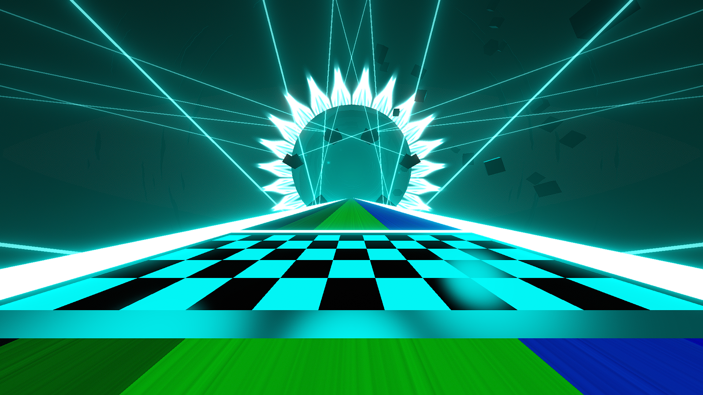

# Accelerate Environment

**Showcase Maps:**
UNUSED

# How To Use

- Left / Right Laser ID's [1, 3, 5, 7, 9] Will effect the lasers stemming from the pillars underneath
- Left / Right Laser ID's [2, 4, 6, 8] Will effect the lasers coming from the floating cubes above
- Center lights will effect the lines on the sides of the rainbow bridge as well as the line just after the start line
- Back Lasers will effect the star outline that sits behind the big sphere in the distance and remains fundementally the same
- Inner Rings ID's [1, 2, 3, 4] Will effect the lines that are off to the sides of the bridge
- Inner Rings ID 5 will effect a bloom light that sits behind the sphere and forms an eye shape
- Ring Rotation will effect the scattered cubes that will float around the player
- Ring Zoom will move the side lasers across the bridge up and down (down is the default position) as well as bounce the floating cubes above the bridge up and down

# Accelerate (No Start Line) Environment
.png)

# How To Use

- Works the same as the original except the glow stick that was lined through the center of the road in front of ths start line is now gone