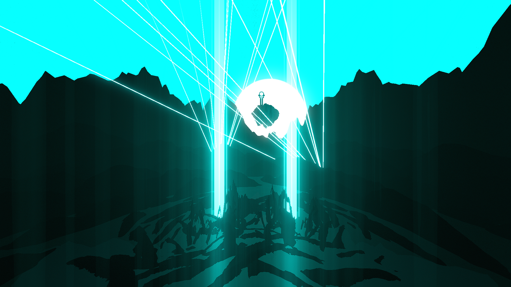

# Spellbound Environment

**Showcase Maps:**
- https://beatsaver.com/maps/3714c

Last Modified: 11/10/23

# How To Use

- Note that this environment has a lot of pieces randomly generated and is super customizable. It is envouraged that you play around with the const values to figure out what looks best for you
- Left / Right Lasers pop out of the sides of the mountain
- Water 4 Will effect the light sticks that shoot up from underneath, LightID 1 for the big center one, LightID 2 - 4 for the little sticks around ir going left to right
- Water 1 does the same as Water 1 but on the right side
- Water 2 Will effect the lights on the tower sitting on top of the mountain. LightID 1 will effect the base pillar, LightID 2 will effect the bottom support, LightID 3 will effect the top support, and LightID 4 will effect the glowing sphere that sits on top
- Water 3 Will effect the rain based properties of the environment. LightID 1 will effect the aurora light sitting behind the floating island, LightID 2 will effect the rain particles floating upwards. LightID 3 and 4 are unfunctional
- Left / Right Sunbeams control the waving lights that float around the edges of the environment
- Sun is positioned behind the floating island and works with both sun and moon