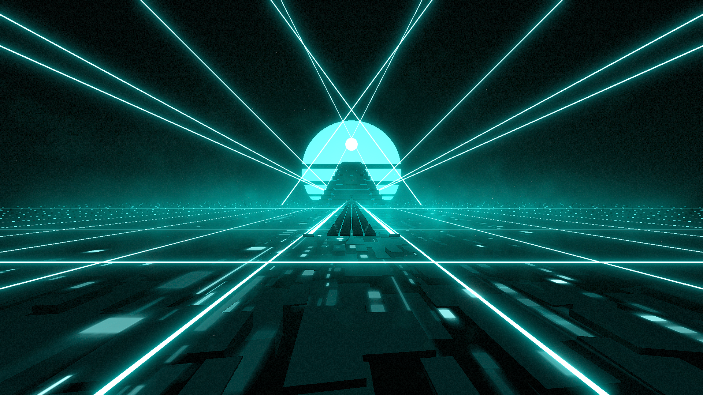

# Synthwave Environment

**Showcase Maps:**
-

Last Modified: 12/21/23

# How To Use

- Back Lasers will effect the sphere above the tower on lightID 1 and the ambient light on lightID 2
- Big Rings will effect the light floor grid of the environment. lightID's 1-30 will effect the lights from left to right, lightID's 31-62 will effect the lights from backward to forward
- Left / Right lasers shoot out from the neyond the pyramid and remain functionally the same. These will also effect the glitch texture below the player
- Center lights will effect the sun. lightID 1 will effect the bottom segment, lightID 4 will effect the top segment.
- Ring spin + zoom is not present in this environment