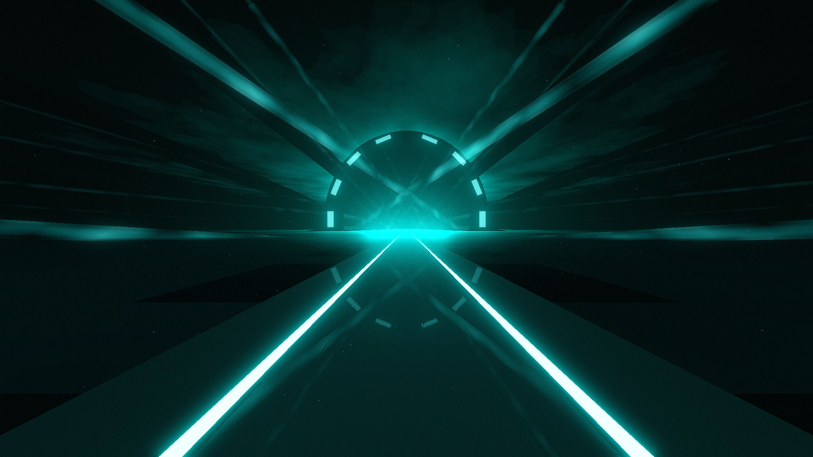

# Tunnel Environment

**Showcase Maps:**
UNUSED

Last Modified: 7/13/23

# How To Use

- Left / Right Laser ID's [1 - 18] Will effect the spinning light sticks that float around the bridge
- Left / Right Laser ID's [19 - 20] Will effect the long flat sticks along the center tunnel's inner sides
- Front Lasers effect the 2 lines that merge with the bridge and remain fundementally the same
- Top Lasers will effect the rectangular lights that line the entry surface of the tunnel and form a circle shape. Using alt + p in chromapper will display 16 light ID slots, however only 8 lights are used. 2 ID slots will each only effect 1 light. ID's [1 - 16] Will work as usual starting with light ID 1 on the left and light ID 16 on the right
- Back Light will effect the bloom light that lines the center of the tunnel

# Tunnel (Light Tunnel) Environment
.png)

# How To Use

- Works the same as the original except the Left / Right Laser ID's [1 - 18] are now located around the tunnel and give off a nice aura like effect