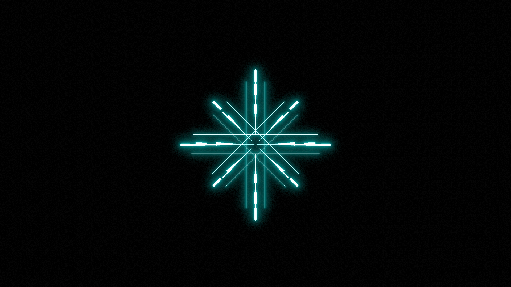
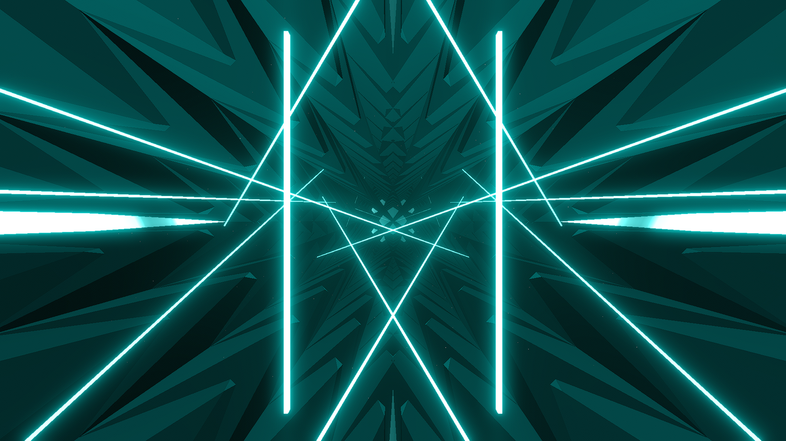

# Important Info
This page contains all the environment edits i've published! You can either click on the folders above to browse by base game environment or scroll down for a list of environments in order of date added to this library.

All screenshots contained in the folders have the lights set on with a value of [0, 1, 1, 1] w/ vanilla laser speed enabled. Some screenshots will have been modified with ring spins / zooms to showcase all the possible effects

All Scripts for each environments will contain the following statement that you can modify to serve as input / output. All will by default have ExpertPlusLawless.dat as the input and ExpertPlusLightshow.dat as the output.

# Absence Environment (Billie)
)
# Abstraction Environment (BTS)

# Mainframe Environment (Dragons)

# Illuminous Environment (Kaleidoscope)

# Light Bridge Environment (Origins)

# Ascension Environment (Panic!)
