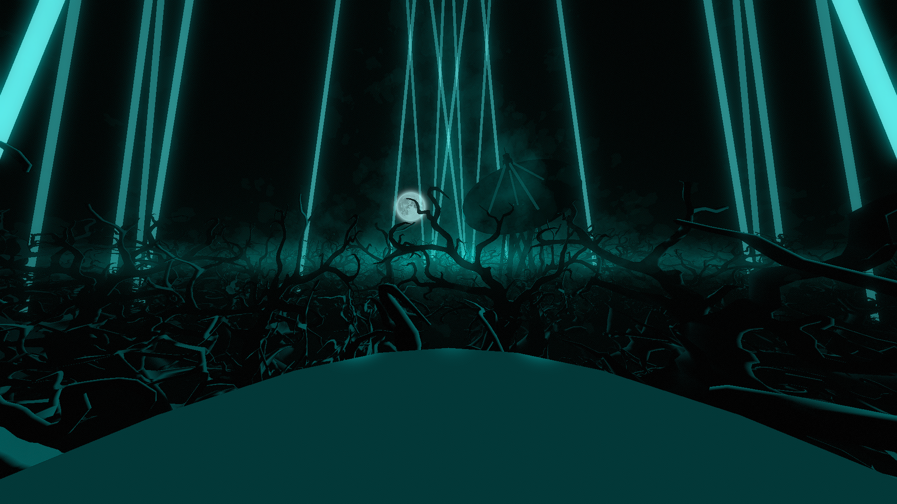

# Signal Environment

**Showcase Maps:**
- https://beatsaver.com/maps/34382
- https://beatsaver.com/maps/343f8
- https://beatsaver.com/maps/34441

Last Modified: 8/9/23

# How To Use

- Left / Right Lasers shoot from the sky and circle around the environment when used with laser rotation events (Only about 1/3rd of the lasers are visible at a time when spinning)
- Top lights effect the light bloom that covers the center of the environment to give off a nice glow
- Lane lights effect the sticks coming out from the center of the satellite dish. ID 1 will effect the 4 sticks coming from the corners and ID 2 will effect the stick coming up from the center
- Moon is offset to the left and remains functionally the same
- This environment comes with a smoke modifier and forest generator, use the defined values at the top of the script to mess around with them and fully get a grasp of how they work