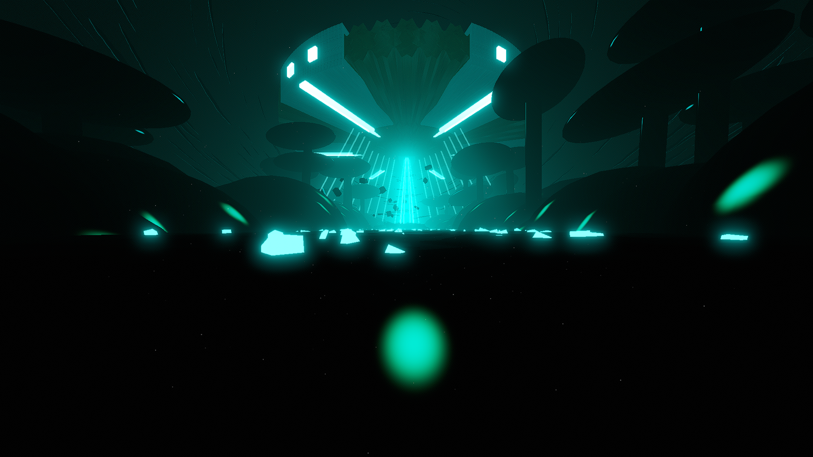

# Cookie Environment

**Showcase Maps:**
- [A Cookie From Space](https://beatsaver.com/maps/3b7b0)

# How To Use

- Left and Right Lasers both stem down from the UFO above
- Center lights effect the 3 light segment beams that stem from the UFO above
- Back Lasers will effect the bloom light in the center of the distance
- Inner Ring ID's will effect the Laser Beam coming from the UFO. Odd numbered ID's effect the smaller outer lines, Even numbered ID's will effect the larger center lines. The remaining ID's are used for the cubes scattered across the ground, 1/4th of each being hooked to each of the 4 ID's
- Rings events will spin the suspended cubes around the UFO beam