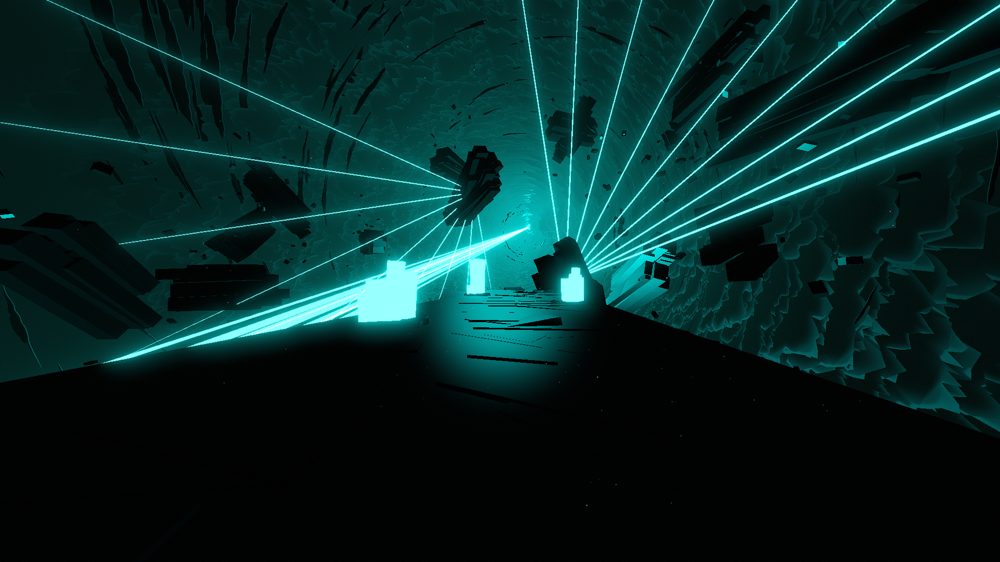

# Hailstorm Environment

**Showcase Maps:**
- [Surface](https://beatsaver.com/maps/3858e)

Last Modified: 12/26/23

# How To Use

- Left and Right Lasers both stem from the suspended rocks on the left and right of the player
- Center lights effect the 3 crystals on the player platform. ID 1 effects the closest, ID 3 effects the furthest
- Back Lasers will effect the bloom light hooked up to the Vortex in the distance
- Inner Ring ID's will effect the Laser Beam coming from the Vortex. Odd numbered ID's effect the smaller outer lines, Even numbered ID's will effect the larger center lines. The remaining ID's are not used in the environment
- Rings are disabled and removed from the environment