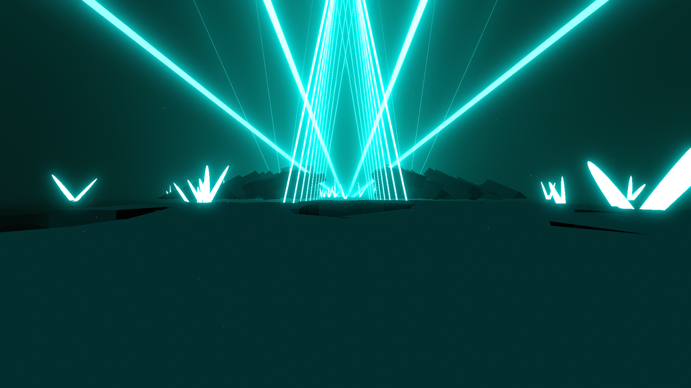

# Overflow Environment

**Showcase Maps:**
- [Overflow](https://beatsaver.com/maps/38836)

Last Modified: 1/1/24

# How To Use

- Left and Right Lasers both stem from the ground on the left and right and remain functionally the same
- Center lights effect the floating circle lights in the air (Does not work with ID's)
- Back Lasers will effect the bloom light coming from the center of the two rock formations
- Inner Ring ID's that are odd will effect the left lasers stemming from the top of the left rock structure, Inner Ring ID's that are even will effect the right lasers stemming from the top of the right rock structure. The final 4 ID's are linked to the 4 light pillars that shoot from the center in the distance
- Rings are disabled and removed from the environment

# Overflow (Pulse) Environment
.png)

# How To Use

- Same as above, just a showcase of the animations in play