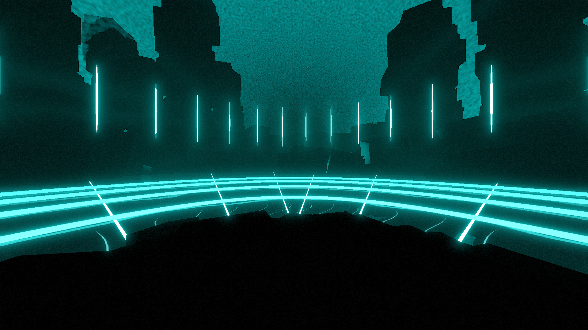

# Enchantment Environment

**Showcase Maps:**
- [Apologize](https://beatsaver.com/maps/3ea7f)

# How To Use

- Note that this environment is engineered to be used with 360 mapping, therefore all elements of the mapping extend all around the player
- Left / Right Lasers stem out from below the player
- Water 4 effects the ring lights on the floor, closest to furthest
- Water 2 and Water 3 effect the sky gradient effect (does not work with LightID's)
- Left and Right Sunbeams effect the stick lights that circle around the environment.
- Sun light effects directionallight and a subtle bloom light on the player