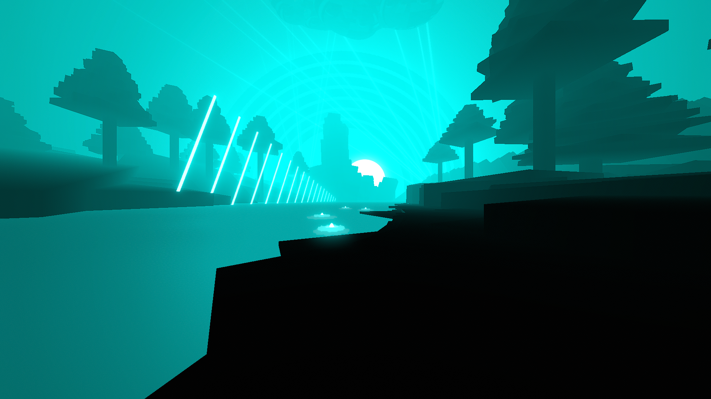

# Lilly Environment

**Showcase Maps:**
- [lake mirror](https://beatsaver.com/maps/3ca8c)

# How To Use

- Left / Right Lasers stem out above the player in the sky and remain functionally the same
- Water 1, 2, 3 & 4 All control the lilly flowers on the river by the player. LightID1 controls the lilypad, LightID2 controls the flower petals, LightID3 controls the flower center, LightID4 controls the flower bulb
- Left Sunbeams control the stick lights to the left of the environment. LightID1 is the closest to the player, LightID18 is the furthest
- Sun effects the big sun in the background of the environment and remains functionally the same. Does not function with moon and boost lights. Do not use all lights on this lane as it will conflict with the gradient lights.
- Right Sunbeams are connected to the rainbow shape in the background. This is by default not present in the environment. LightID1 is the outermost ring, LightID7 is the innermost ring. The rest of the ID's do nothing
- Right Sunbeams All Lights are connected to the beam lights. These are by default not present in the environment. They only function with the animation activated in the script.
- The Gradient Light is bound to type 4 (Sun Light) and can be used with the presets shown in the script to set different atmospheres. See the formatting of the section to understand how it works. The original gradient data from lake mirror is left in the script, you can reference there to see how things work and what things look like.