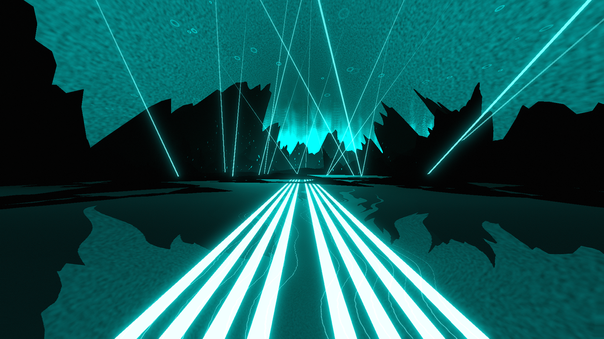

# Mystic Environment

**Showcase Maps:**
- [Nobody](https://beatsaver.com/maps/33f20)
- [Back to the Light / Oceans of Luma](https://beatsaver.com/maps/3543a)

Last Modified: 7/12/23

# How To Use

- Left / Right Lasers stem out of the ground around the center and remain functionally the same
- Water 1, 2, 3 & 4 All control the sticks at the bottom nearby the player (1 being the furthest out, 4 being the furthest in)
- Left / Right Sunbeams control the waving lights in the sky and best work with random laser speed instead of locked chroma rotation
- Sun effects the surface of the water and gives it a nice glow in the distance
- The Aurora like object in the background will react to all other light in the environment and is sensitive so try fiddling around with it to see how it reacts
- Activiating Boost Colors will get rid of the sun