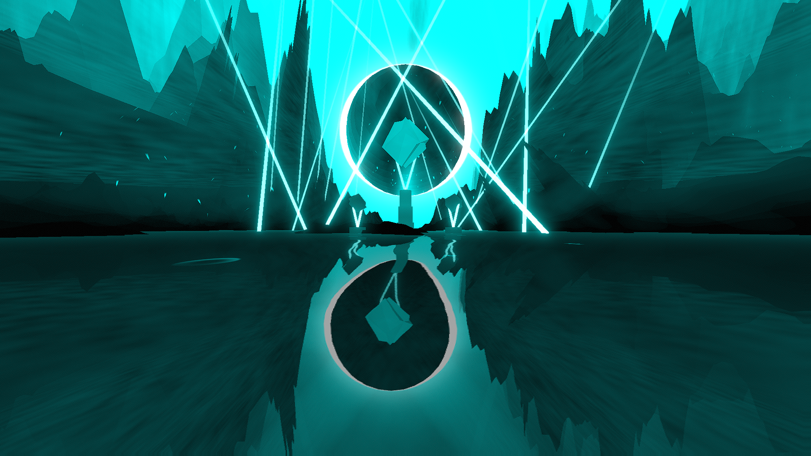

# Sight Environment

**Showcase Maps:**
- [If I See You](https://beatsaver.com/maps/331fe)

Last Modified: 7/12/23

# How To Use

- Left / Right Lasers stem out of the ground around the center and remain functionally the same
- Water 1 Will effect the light sticks supporting the cube to the left
- Water 2 Will effect the light sticks supporting the cube to the right
- Water 3 Will effect the light sticks supporting the cube in the center
- Water 4 effects the 2 big beams that overhand the cliff in the back
- Left / Right Sunbeams control the waving lights that float around the edges of the environment
- Sun is located behind the big sphere and acts as an edge light
- The Aurora like object in the background will react to all other light in the environment and is sensitive so try fiddling around with it to see how it reacts
- Activiating Boost Colors will get rid of the sun