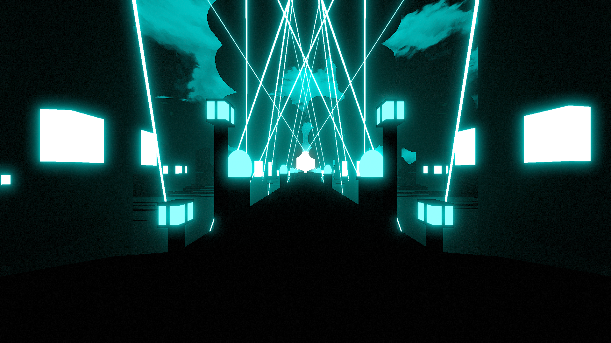

# Sylva Environment

**Showcase Maps:**
- UNUSED

# How To Use

- Water 2 / 3 effect the structures on the trees to the left and right of the player.
- Water 1 effects the pole lights that sit in fron of the player
- Left / Right Sunbeams effect the pole lights that align the bridge, 1st id being the closest
- Left / Right Lasers function same as the base environment
- Sun lights function same as the base environment
- Water 4 isn't used but is a good function to force directionallight on the environment