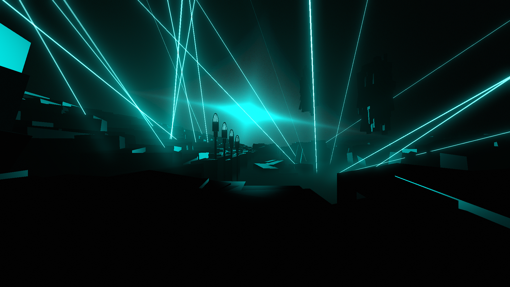

# Time Environment

**Showcase Maps:**
- UNUSED

# How To Use

- Water 3 effects the bulb lights to the left of the environment. ID 1 is the furthest away
- Left / Right Lasers function same as the base environment
- Left / Right Sunbeams effect the star shape in the sky. While technically usable as ID's, it works best with all light events
- The Gradient Light is bound to type 4 (Sun Light) and can be used with the presets shown in the script to set different atmospheres. See the formatting of the section to understand how it works. you can also reference Lake Mirror to see how it functions