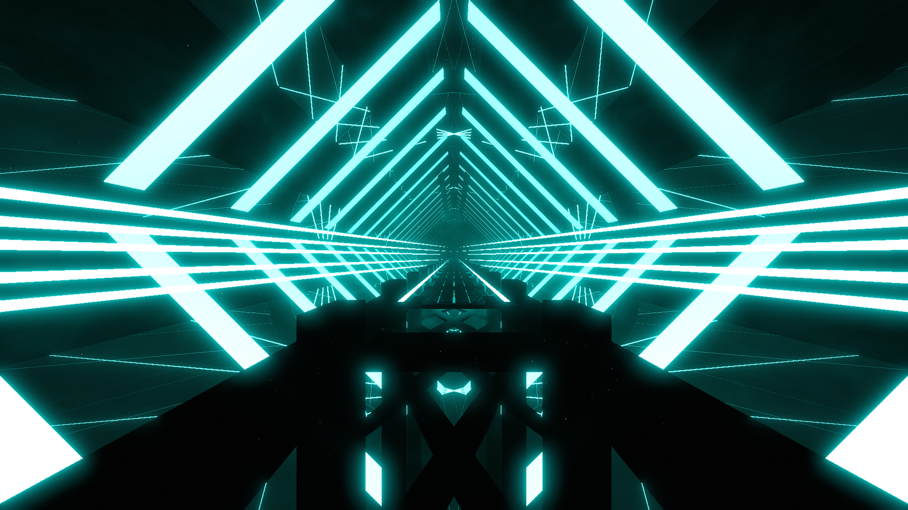

# Internet Environment

**Showcase Maps:**
- COMING SOON

Last Modified: 2/23/24

# How To Use

- Back Lasers are bound to background elements. LightID 1 will effect the 2 bridge beams on the floor, LightID 2 will effect a subtle background ambient light
- Big Rings are scaled up and remain functionally the same
- Left / Right lasers shoot out from the sides of the environment. They are not heavily modified by laser speed events, rather taking on a static effect with different values.
- Center lights will effect the square formation lights on the outside of the environment. LightID 1 is the right side, LightID 2 is the top side, LightID 3 is the left side, LightID 4 is the bottom side
- Ring Zoom is unused

This Environment makes use of the Cinema mod, If you want to use it then be sure to set cinemaScreen = true and download and configure the cinema.json file attatched (disabled by default)