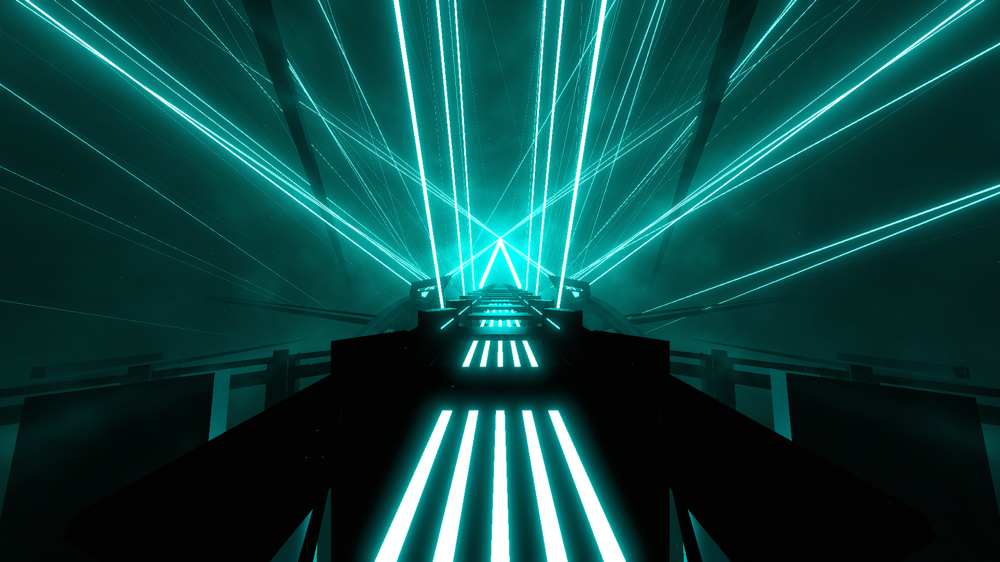

# Strand Environment

**Showcase Maps:**
- UNUSED

# How To Use

- Left / Right Lasers Are set along the sides of the track and remain functionally the same
- Back Lasers sit and point to the sky along the bridge and remain functionally the same
- Big Ring Neons are set to the bottom of the bridge
- KDA Light Sticks are positioned in the background of the environment and remain functionally the same
- The Front Light overarches the environment front and center and remains functionally the same