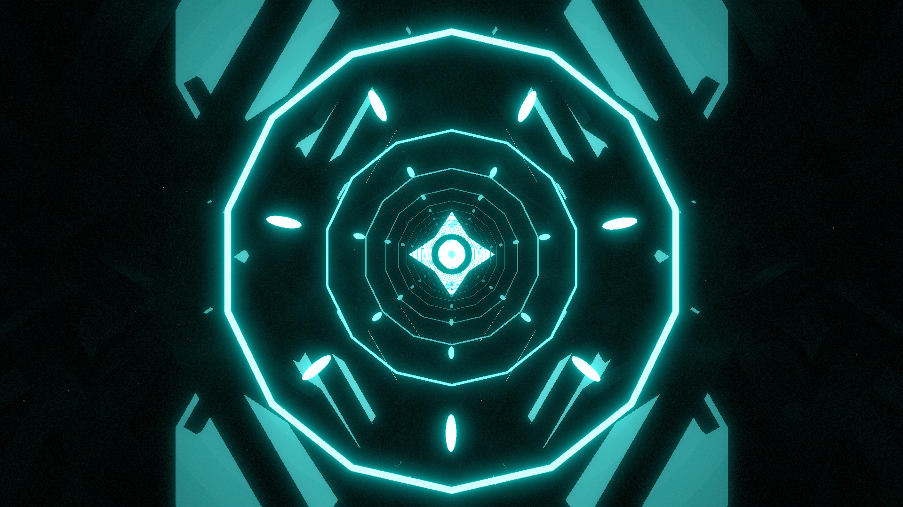

# Portal Environment

**Showcase Maps:**
- UNUSED

# How To Use

- Left / Right Lasers are bound to the background squares in the environment. This element is very subtle.
- Center Lights are bound to the circle shapes that go down the center of the environment.
- Back Lasers are bound to the end wall portal part of the environment.
- Big Rings effect the spheres that run down the center of the environment.