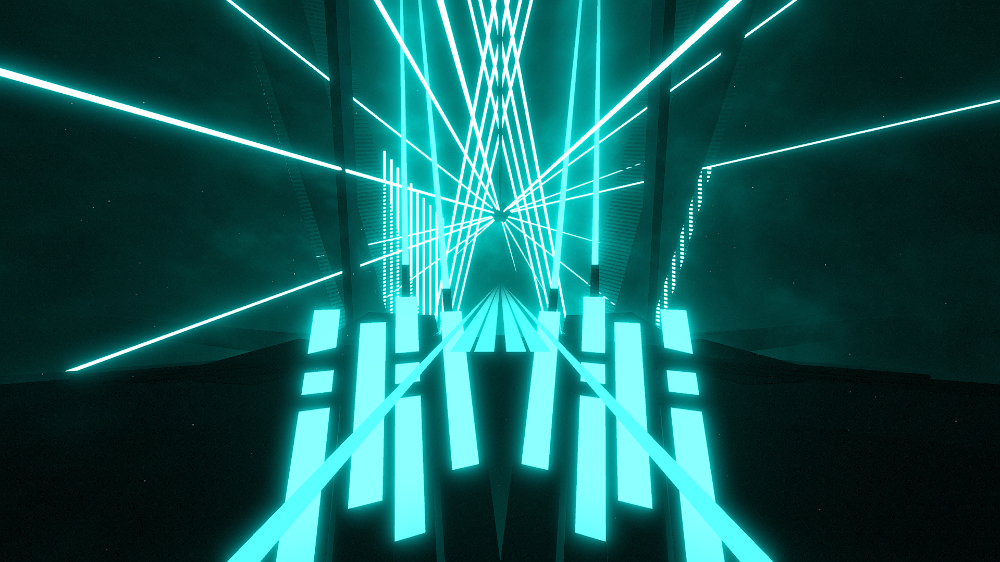

# Club Environment

**Showcase Maps:**
- [Madeline](https://beatsaver.com/maps/439cd)

# How To Use

- Left / Right Lasers are bound to the ball towards the top of the environment and remain fundementally the same. ID's 5 - 7 are bound to the lights that make up the bridge.
- Back lasers are bound above the environment to form V shape lights
- Rings are bound to the outside of the environment and spin around the environment. Ring Zoom doesn't work with it.
- Center Light ID's 1-8 are bound to the squares that make up the bottom sides of the wall of the environment. ID's 9-12 are connected to the light beams that extend from the objects