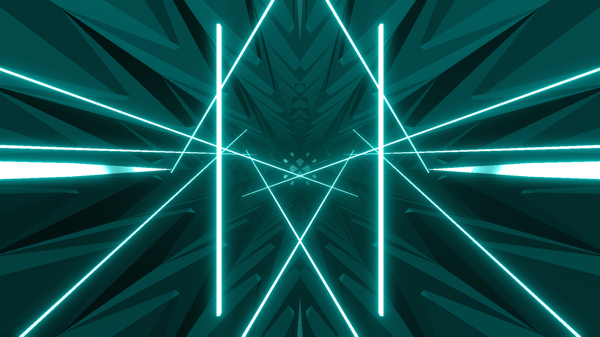

# Ascension Environment

**Showcase Maps:**
- [✧✦lest i ascend out of your reach✦✧](https://beatsaver.com/maps/33d46)

Last Modified: 7/9/23

# How To Use

- Left / Right Lasers Are hovering along the sides of the tunnel and stay fundementally the same
- Center Lights effect the massivly upscaled Mirror in the distance
- Big Rings effect the rings as normal and are positioned behind the player by default. Either move them forward to your liking by searching for *"Panels4TrackLaneRing\\(Clone\\)$* and modifying them or by using large step values for ring zoom (around 50 - 100)
- Back Lasers effect the 2 pillars to the sides of the environment and remain fundementally the same
- This environment comes with it's own spike generator! Change the values at the top of the script to mess around and get different results