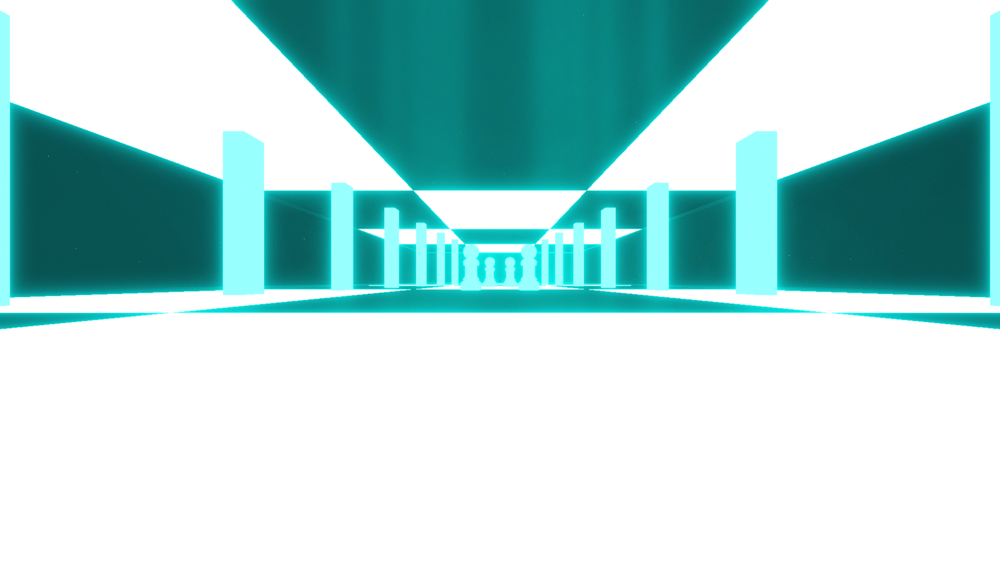

# Superliminal Environment

**Showcase Maps:**
- https://beatsaver.com/maps/35d1a

Last Modified: 9/21/23

# How To Use

- Left / Right Lasers control the pillars along the sides of the environment, ID 1 being closest, ID 7 being furthest (Does not work with laser speed events)
- Center Lights effect the box itself that the player sits in. ID 1 effects the floor, ID 2 effects the cieling, ID 3 effects the left wall, ID 4 effects the right wall, ID 5 effects the back wall, ID 6 effects the front wall.
- Big Ring Lights effect the chess pawns in the center of the environment. ID 1 effects the front left piece, ID 2 effects the front right piece, ID 3 effects the back left piece, ID 4 effects the back right piece.
- Back Lights effect the tile pattern that lines the floor and cieling. ID 1 effects the furthest tiles, ID 11 effects the closest tiles. The floor and cieling tiles are both effected by one ID light and are seperated by row.