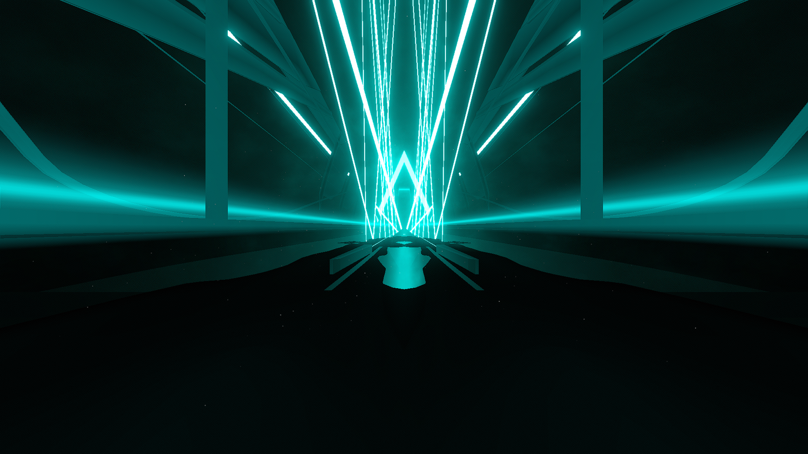

# Weave Environment

**Showcase Maps:**
- UNUSED

# How To Use

- Left / Right Lasers are stationed along the sides of the bridge and remain functionally the same
- Center Lights effect the lines along the bridge and the chevron distant light. The 1st ID part of the goal light is removed from the environment
- Big Ring Lights effect the beams of light closer in the sky
- Back Lights effect both the neon shaped arch light going from the front to the back of the enviro as well as the bigger sky beamse at the top of the environment