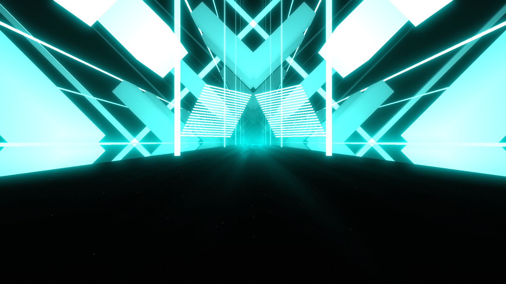

# Energy Environment

**Showcase Maps:**
- UNUSED

# How To Use

- Center Lights will effect the bloom lights on the center of the bridge (not compatible with lightIDs)
- Ring lights effect the big arrow square shapes that spin around the environment
- left / right lasers effect the infrastructure around the environment. These components are scaled with contains so the ID's remain similar to their vanilla position
- additional left / right lasers effect the lines in the center above the environment. You can use laser speed events for some wibble woobles