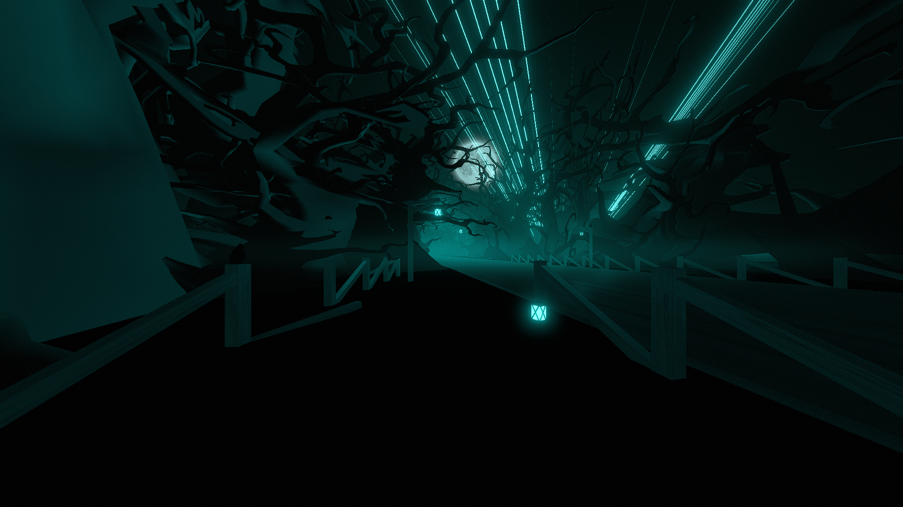

# Morality Environment

**Showcase Maps:**
- [Dead Voxel](https://beatsaver.com/maps/359ce)
- [Roots](https://beatsaver.com/maps/367d2)

Last Modified: 9/12/23

# How To Use

- Left / Right Lasers Spew from inside the trees to the right across the road. With laser speed they spread in a circle formation. With no spread they all stay in the same place to form a single line.
- Lane Lights effect the bloom light that spews out from the end of the road.
- Moon is offset up and to the right and remains functionally the same
- Top Lights control the 4 lanters that are spread around the environment. These are compatible with the 4 LightID's that come with top lasers by default. 1 controls the lantern sat on the floor beside the player, 2 controls the nearest lamp post to the left, 3 controls the lantern hanging from the tree branch over the road and 4 Controls the lamp post across the road to the right.