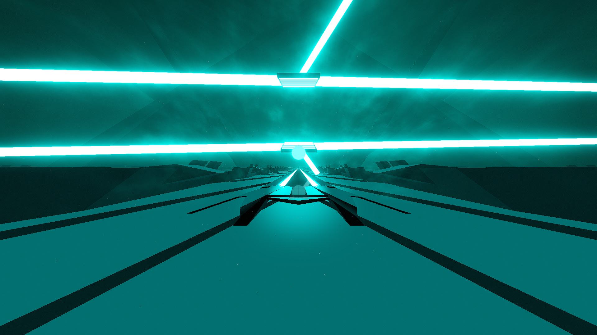

# Cyclone Environment

**Showcase Maps:**
- UNUSED

# How To Use

- All lightID's are bound to the original environment to the point that you can light in the original and it will remain mostly mirrored in here
- do note that utilizing ring zoom events to put the rings backwards can clip into the center lights