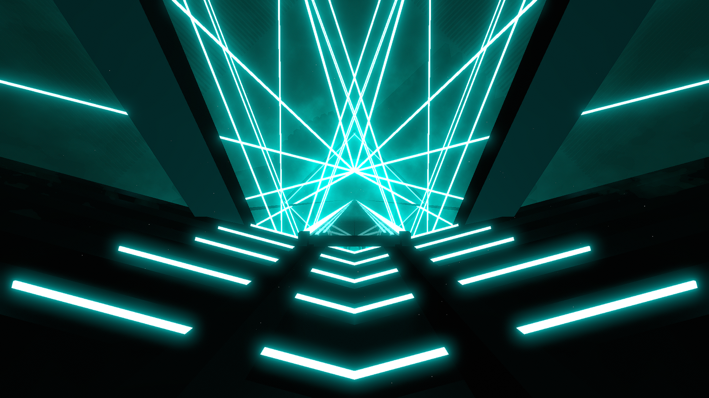

# Binary Environment

**Showcase Maps:**
- [Clique](https://beatsaver.com/maps/38a2a)

# How To Use

- Left / Right Lasers are positioned to the sides of the bridge and remain functionally the same
- Big Rings are positioned around the center. The object is flattened so ring zoom won't work and individual lightID effects will be less visible
- Back lasers will effect the lights on the ground below the player. LightID 1 is closest to the player, LightID 10 is the furthest. Odd numbered ID's are the left side, Even are the right
- Center Lights effect the light sticks forming a shape above the bridge. LightID 1 effects the furthest light to the left, LightID 10 effects the furthest light to the right